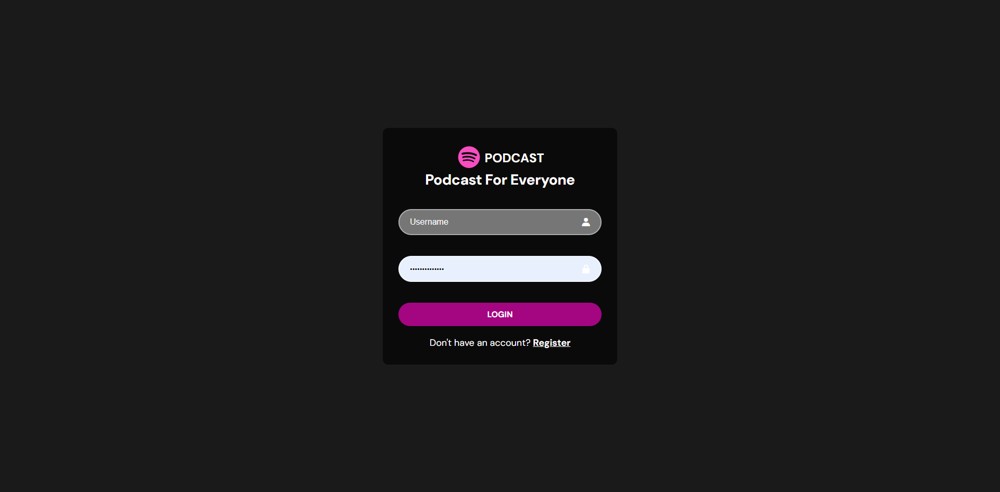
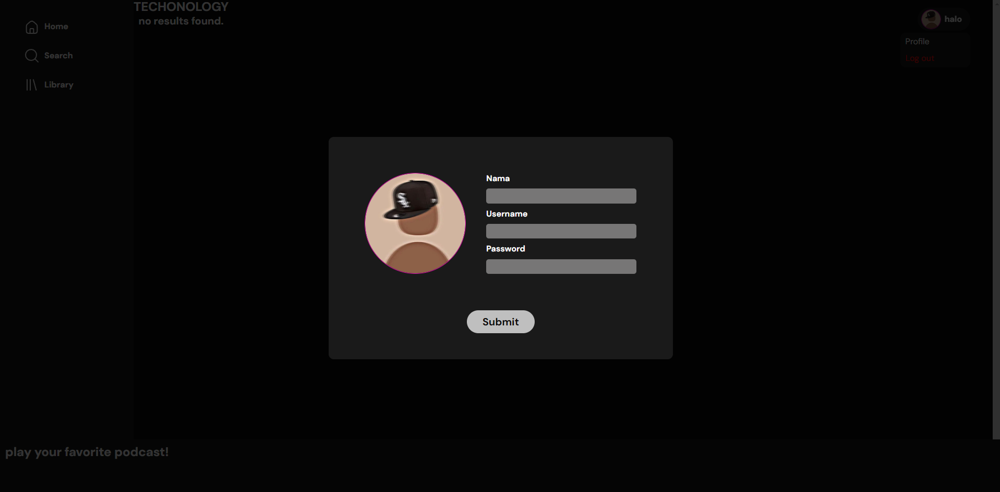
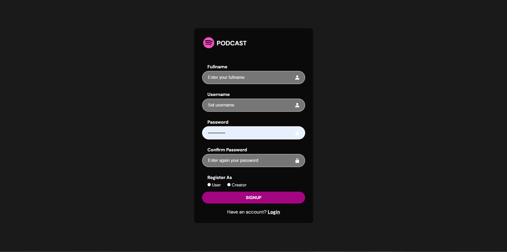
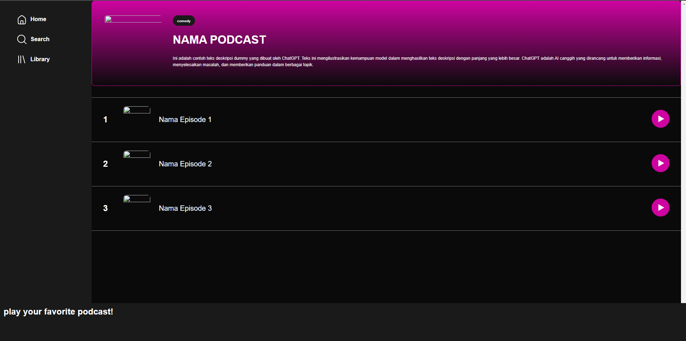
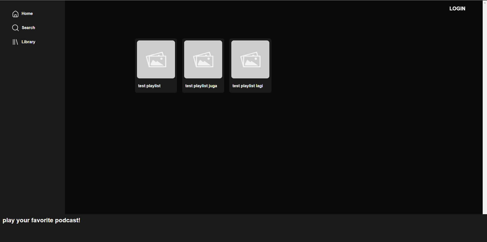
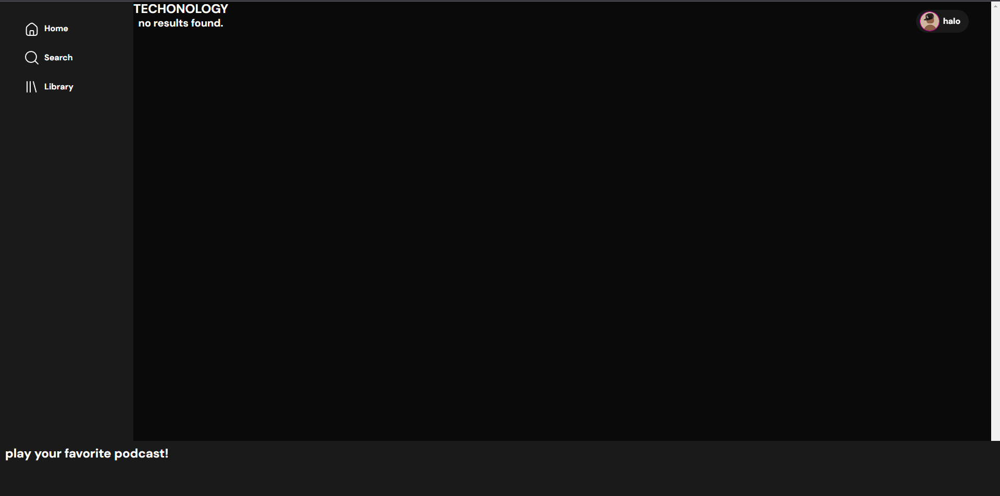

# Podcast Website

## Daftar Isi
- [Deskripsi Aplikasi *Web*](#deskripsi-aplikasi-web)
- [Daftar *Requirement*](#daftar-requirement) 
- [Cara Instalasi](#cara-instalasi)
- [Cara Menjalankan *Server*](#cara-menjalankan-server)
- [Screenshot Tampilan Aplikasi](#screenshot-tampilan-aplikasi)
- [Pembagian Tugas](#pembagian-tugas-server--client-side) 

## Deskripsi Aplikasi Web
Podcast Website (tanpa nama) ini adalah website yang dapat digunakan untuk mendengarkan podcast. Website ini menerapkan konsep autentikasi pengguna, implementasi CRUD, searching, filter, pagination, dan responsivitas. 

## Daftar *Requirement*
1. Login
2. Register
3. Home
4. Search, Sort, dan Filter
5. Tambah Podcast
6. Tambah Episode
7. Edit Podcast
8. Pemutar Podcast
9. Library
10. User Profile

## Cara Instalasi
1. Lakukan pengunduhan repository ini dengan menggunakan perintah `git clone https://gitlab.informatika.org/if3110-2023-01-19/tugas-besar-1.git` pada terminal komputer Anda.
2. Pastikan komputer Anda telah menginstalasi dan menjalankan aplikasi Docker.
3. Buatlah sebuah file `.env` yang bersesuaian dengan penggunaan 

## Cara Menjalankan *Server*
1. Anda dapat menjalankan program ini dengan menjalankan perintah `docker compose up` pada terminal directory aplikasi web.
2. Aplikasi web dapat diakses dengan menggunakan browser pada URL `http://localhost:8080/public/home`. 
3. Aplikasi web dapat dihentikan dengan menjalankan perintah `docker compose down` pada terminal directory aplikasi web.

## Screenshot Tampilan Aplikasi 

## Pembagian Tugas (Server & Client Side)

| Fitur                     | NIM      | 
| --------------------------| ---------|
| Login                     | 13521079 |
| Register                  | 13521079 |
| Home                      | 13521149 |
| Search, Sort, dan Filter  | 13521119 |
| Tambah Podcast            | 13521149 |
| Tambah Episode            | 13521149 |
| Edit Podcast              | 13521149 |
| Pemutar Podcast           | 13521119 |
| Library                   | 13521079 |
| User Profile              | 13521119 |